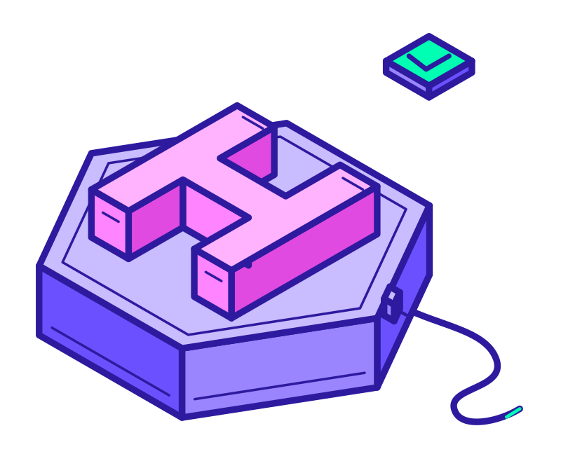
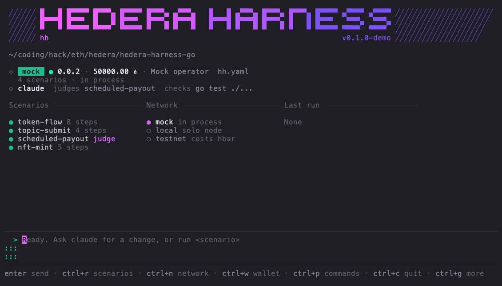

# hh

<p>
  
  <br>
  <a href="https://github.com/Gmin2/hedera-harness-go/releases"></a>
  <a href="https://github.com/Gmin2/hedera-harness-go/actions/workflows/ci.yml"></a>
  <a href="LICENSE"></a>
</p>

A harness for the Hedera ecosystem. Build dapps with an agent, run real transactions, and check the result on chain in code.


The above example was generated with [VHS](https://github.com/charmbracelet/vhs) ([view source](./demo/hero.tape)).

## Tutorial

Start a project and run its first scenario. No account and no network needed, it runs on an in process mock.

```sh
hh init my-project
cd my-project && hh run
```


## Build a dapp

Create a [scaffold-hbar](https://github.com/hedera-dev/scaffold-hbar) project with the official [hedera skills](https://github.com/hedera-dev/hedera-skills), then describe what you want.

```sh
hh init --scaffold-hbar my-dapp --install
cd my-dapp && cp .env.example .env    # a testnet account from portal.hedera.com
hh
```

```
build a page where I can swap HBAR for USDC
```

The agent writes the contracts, deploy scripts and the page. It never holds a key. After every attempt hh compiles, type checks and deploys to testnet with the connected wallet, and sends failures back into the same conversation until everything passes.



## Scenarios

A scenario runs real hedera transactions with named accounts, then checks chain state on the mirror node.

```yaml
actors:
  alice: {}
  bob: {}

steps:
  - hbar.transfer: { from: alice, to: bob, amount: 2.5 }

assert:
  - account.hbar: { account: bob, equals: 12.5 }
```

```sh
hh run examples/01-first-transfer.yaml               # mock, milliseconds
hh run examples/01-first-transfer.yaml -n testnet    # the same file on testnet
```


Tokens with kyc, freeze and pause, airdrops, nfts, custom fees, topics with running hash verification and multisig schedules are all covered, and all seven [examples](./examples) pass on testnet ([hashscan links](./docs/guide.md#verified-on-testnet)).

## Check before you spend

Scenarios are validated offline, with the line of every mistake.

```sh
hh check scenario.yaml
```


## Installation

```sh
# macOS apple silicon, or darwin_amd64, linux_amd64, linux_arm64, windows_amd64.zip
curl -sL https://github.com/Gmin2/hedera-harness-go/releases/latest/download/hh_darwin_arm64.tar.gz | tar xz

# or with go 1.26
go install github.com/Gmin2/hedera-harness-go@latest
```

The agent uses the [claude cli](https://claude.com/claude-code) with your existing login.

## Commands

| | |
|---|---|
| `hh` | the tui: prompts, `/judge`, `/check`, ctrl+w wallet, ctrl+r scenarios, ctrl+n network |
| `hh init [--scaffold-hbar]` | start a project or a dapp |
| `hh agent <prompt>` | the agent loop from the cli |
| `hh run`, `hh check` | run or validate scenarios |
| `hh wallet`, `hh doctor` | check the account before spending anything |

Configuration, networks, wallets and every step and assertion are in the [guide](./docs/guide.md).

## Compared to hedera-harness

hh takes direct inspiration from [hedera-dev/hedera-harness](https://github.com/hedera-dev/hedera-harness): the harness decides pass or fail, never the agent.

| | hedera-harness | hh |
|---|---|---|
| start a feature | a recipe: spec, prd, validators, checklist | one sentence |
| agent | unattended batch run | a streaming conversation |
| chain checks | an llm reads curl output | scenarios evaluated in code |
| networks | testnet | mock, solo, testnet |
| language | typescript | go |

## License

[Apache-2.0](LICENSE)
